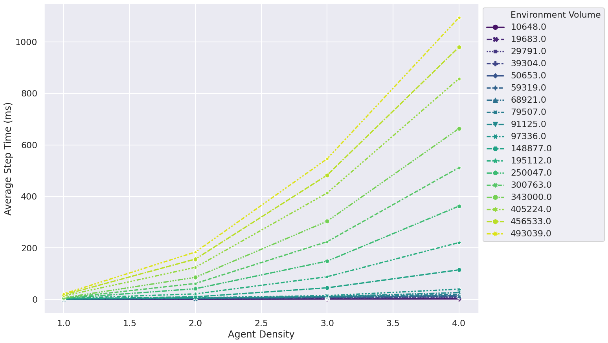

# FLAMEGPU2 Circles Benchmark


This repository contains performance benchmarking of the Circles implemented using FLAME GPU 2 at various population scales.


> **@todo** - Complete the readme.

## Temp instructions

**These are short term instructions that WILL change as things are refined**

```
# Compile
mkdir -p build
cd build
cmake .. -DCMAKE_BUILD_TYPE=Release -DSEATBELTS=OFF -DBUILD_SWIG_PYTHON=OFF -DCUDA_ARCH=61,70
make -j `nproc`

# Run and generate csv files
FLAMEGPU2_INC_DIR=./_deps/flamegpu2-src/include/ ./bin/linux-x64/Release/circles-benchmarking 
# Generte plots
../plot.py row-per-simulation.csv 
```

## Benchmark Results 

> @todo - Hardware / software versions used
+ Titan V
+ CUDA 11.x ?

> @todo - link to committed raw data. 

`sample/data/*.csv`

> @todo - figure(s).


<!--  -->


## Dependencies 

> @todo

## Running the Benchmark

### Compilation

> @todo  - 

```
cmake . -B build -DCMAKE_BUILD_TYPE=Release -DSEATBELTS=OFF -DBUILD_SWIG_PYTHON=OFF -DCUDA_ARCH=61,70
cmake --build build -j`nproc` 
```


### Execution / Data generation

> @todo 

### Data plotting.

> @todo - plotting data.
