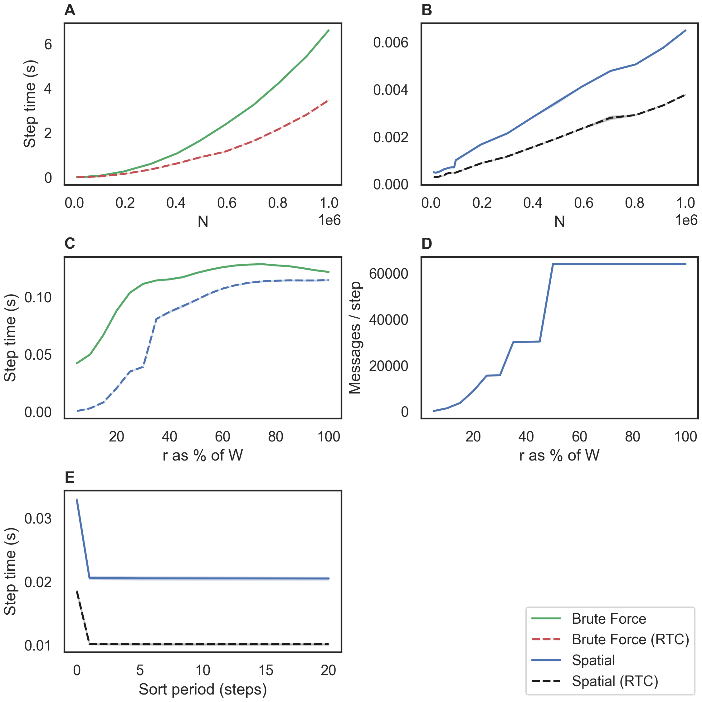
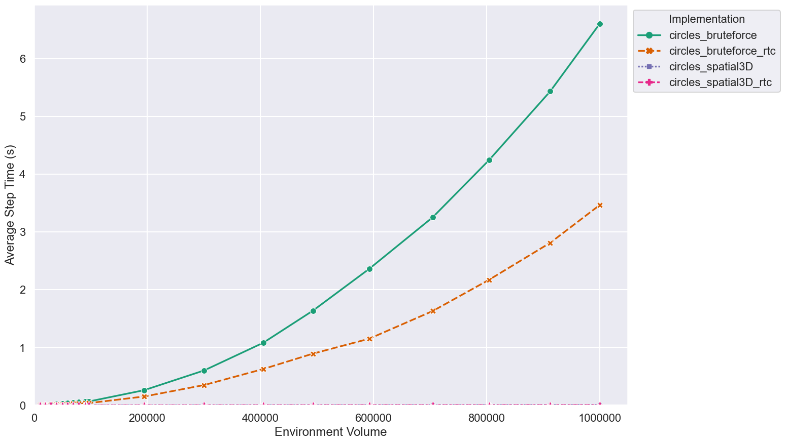
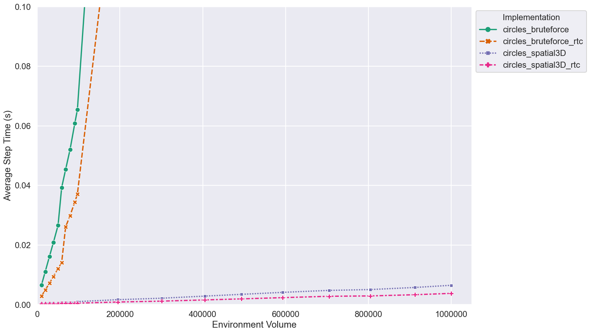
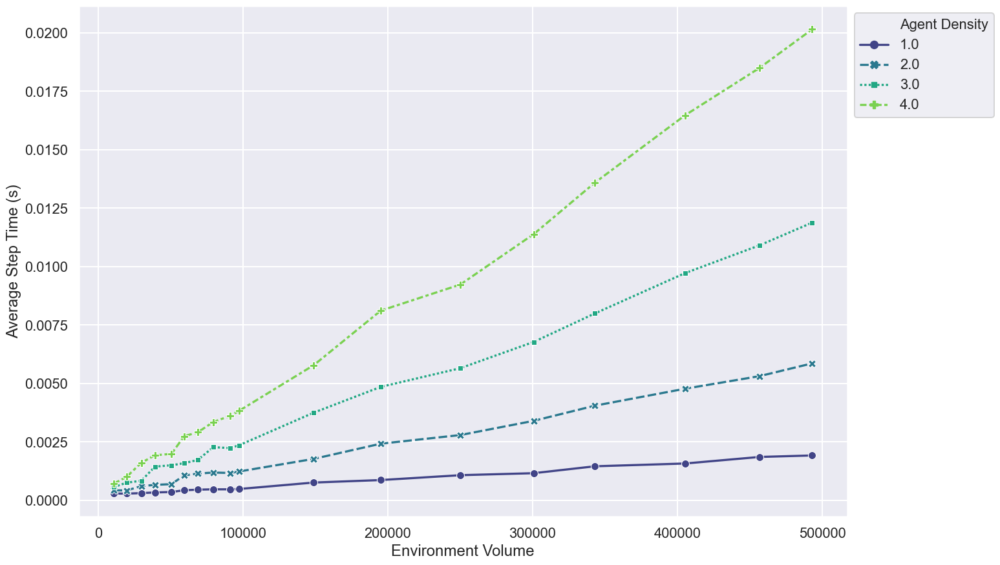
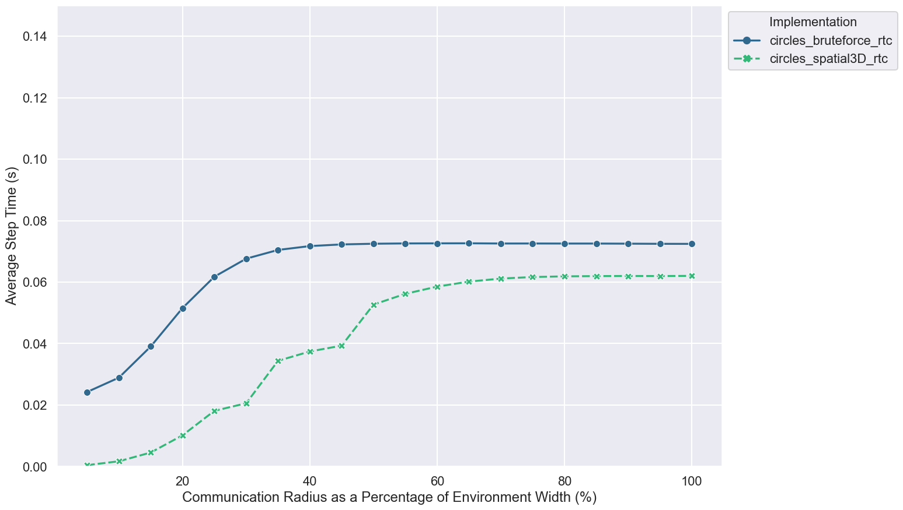
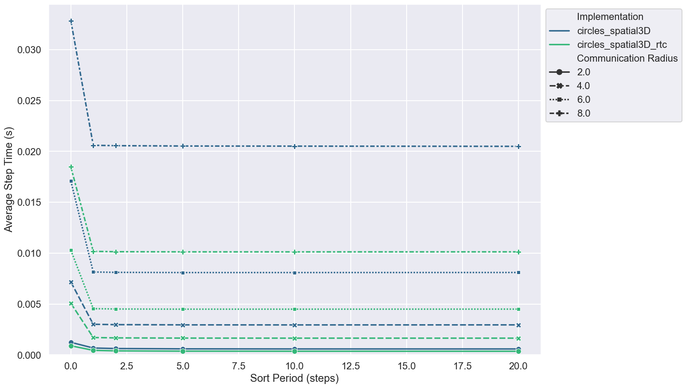

# FLAMEGPU2 Circles Benchmark

This repository contains performance benchmarking of a [FLAME GPU 2](https://github.com/FLAMEGPU/FLAMEGPU2) implementation of the Circles agent based model at various population scales and densities.

In the Circles model is an abstract benchmark model which is used to evaluate neighbourhood search, with agents interacting with other agents within their local neighbourhood.
For a more complete description of the model, see:

[Chisholm, Robert, Paul Richmond, and Steve Maddock. "A standardised benchmark for assessing the performance of fixed radius near neighbours." European Conference on Parallel Processing. Springer, Cham, 2016.](https://doi.org/10.1007/978-3-319-58943-5_25), ([pdf](https://eprints.whiterose.ac.uk/104079/1/paper.pdf)).

## Benchmark Description and Results

Three experiments are undertaken within this benchmark. There is a range of raw data in the [`sample/data`](sample/data) directory with a description of the machine configurations used to generate it in each directory.

The results below are from the V100 runs on the Bessemer HPC system at the University of Sheffield. Job submission scripts are included in the [`scripts/slurm`](scripts/slurm/) directory.

A combined figure for use in publication is shown below. For details please refer to the publication.

[](sample/figures/v100-515.65.01/2.0.0-rc-v100-11.0-beltsoff/paper_figure.png)

### Fixed Density Benchmark

+ Communication Radius is fixed to `2.0`
+ Agent Density is fixed to `1` agent per unit of volume 
+ Environment Volume is varied, with values of up to `1000000` units of volume
+ 4 Implementations are compared
  + Bruteforce messaging
  + Bruteforce messaging with RTC (run time compilation)
  + Spatial3D messaging
  + Spatial3D messaging with RTC (run time compilation)

[](sample/figures/v100-515.65.01/2.0.0-rc-v100-11.0-beltsoff/fixed-density--volume--step-s--model--all.png)
[](sample/figures/v100-515.65.01/2.0.0-rc-v100-11.0-beltsoff/fixed-density--volume--step-s--model--zoomed.png)

### Variable Density Benchmark

+ Communication Radius is fixed to `2.0`
+ Agent Density is varied per unit of volume, from `1` to `4`
+ Environment Volume is varied up to `~ 500000` units of volume.
+ A single implementation is benchmarked
  + Spatial3D messaging with RTC (run time compilation)
		
[](sample/figures/v100-515.65.01/2.0.0-rc-v100-11.0-beltsoff/variable-density--volume--step-s--density--3drtc.png)

### Variable Communication Radius Benchmark

+ `circles_spatial3d_rtc` and `circles_bruteforce_rtc`
+ Varied communication radius - shown on the X axis
+ Model differentiated by marker
+ Agent count is fixed at 64,000
+ Environment width is fixed at 40
+ Agent Density is `1.0f`

[](sample/figures/v100-515.65.01/2.0.0-rc-v100-11.0-beltsoff/comm-radius--lineplot-spatial3D-bruteforce-rtc-only.png)

### Variable Sort Period Benchmark

+ Runs for communication radii of `2.0`, `4.0`, `6.0`, `8.0`
+ Sort period is varied - shown on the X axis - a sort period of 0 represents no sorting, simulation runs for 200 steps in all cases
+ Model differentiated by marker
+ Agent count is fixed at 64,000
+ Environment width is fixed at 40
+ Agent density is `1.0f`

[](sample/figures/v100-515.65.01/2.0.0-rc-v100-11.0-beltsoff/sort-period--lineplot--sort_period--mean_s_step_mean--model-comm_radius.png)

## Building and Running the Benchmark

Detail of dependencies and the `cmake` build process are described in full in the [FLAMEGPU2-example-template Repo](https://github.com/FLAMEGPU/FLAMEGPU2-example-template) and are not repeated here. The benchmark should be built with seatbelts off (e.g. `-DFLAMEGPU_SEATBELTS=OFF` passed to the `cmake` configuration step) to disable additional run-time checks. E.g. for Volta (`SM_70`) GPUs under Linux.

```bash
# Configure 
cmake . -B build -DCMAKE_BUILD_TYPE=Release -DFLAMEGPU_SEATBELTS=OFF -DCMAKE_CUDA_ARCHITECTURES=70
# Build
cmake --build build -j`nproc` 
```

### Execution and Data generation

```bash
cd build
./bin/Release/circles-benchmark
```

This will produce a number of `.csv` files in the `build` directory.

Note: The `FLAMEGPU2_INC_DIR` environment variable may need to be set to `./_deps/flamegpu2-src/include/` for run-time compilation (RTC) to succeed if the source directory is not automatically found.

## Plotting Results

Individual figures can be generated from data in CSV files via a python script `plot.py`. Alternatively a combined figure used for publication can be produced using `plot_publication.py`.

### Dependencies

It is recommended to use python virtual environment or conda environment for plotting dependencies.

I.e. for Linux to install the dependencies into a python3 virtual environment and plot the results from all experiments output to the `build` directory.

```bash
# From the root of the repository
# Create the venv
python3 -m venv .venv
# Activate the venv
source .venv/bin/activate
# Install the dependencies via pip
python3 -m pip install -Ur requirements.txt
# Plot using csv files contained within the build directory
python3 plot.py build -o build/figures
# Use -h / --help for more information on optional plotting script parameters.
```

The sample figures were generated from the root directory using

```bash
python3 plot.py -i sample/data/v100-515.65.01/2.0.0-rc-v100-11.0-beltsoff -o sample/figures/v100-515.65.01/2.0.0-rc-v100-11.0-beltsoff
```

The publication figure was generated using 

```bash
python3 plot_publication.py -i sample/data/v100-515.65.01/2.0.0-rc-v100-11.0-beltsoff -o sample/figures/v100-515.65.01/2.0.0-rc-v100-11.0-beltsoff
```
