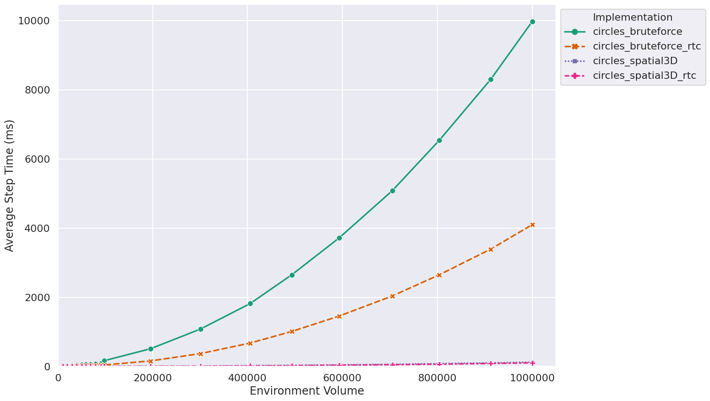
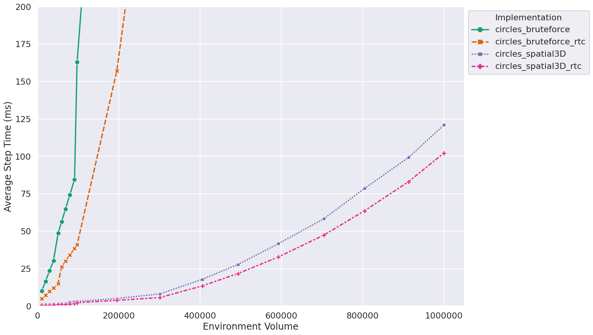
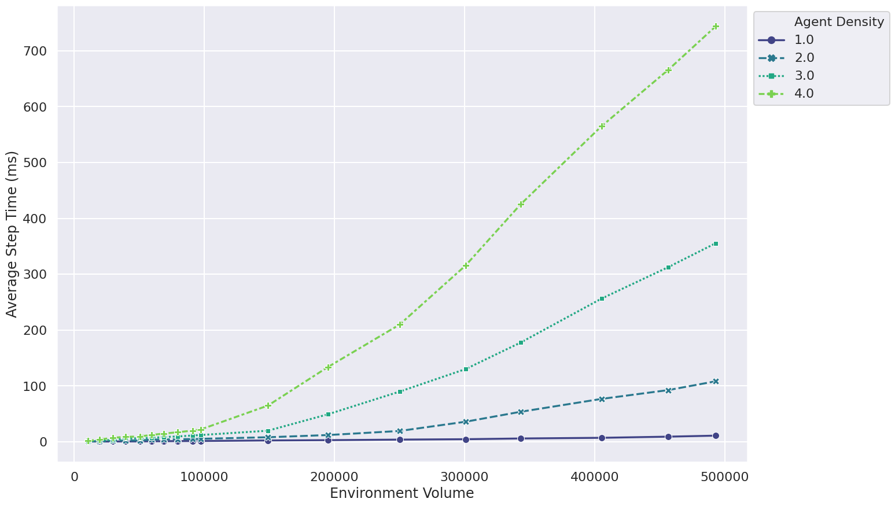

# FLAMEGPU2 Circles Benchmark

This repository contains performance benchmarking of a [FLAME GPU 2](https://github.com/FLAMEGPU/FLAMEGPU2) implementation of the Circles agent based model at various population scales and densities.

In the Circles model is an abstract benchmark model which is used to evaluate neighbourhood search, with agents interacting with other agents within their local neighbourhood. 
For a more complete description of the model, see:

[Chisholm, Robert, Paul Richmond, and Steve Maddock. "A standardised benchmark for assessing the performance of fixed radius near neighbours." European Conference on Parallel Processing. Springer, Cham, 2016.](https://doi.org/10.1007/978-3-319-58943-5_25), ([pdf](https://eprints.whiterose.ac.uk/104079/1/paper.pdf)).

## Benchmark Results 


Two experiments are carried out:

+ Fixed Density
    + Communication Radius is fixed to `2.0`
    + Agent Density is fixed to `1` agent per unit of volume 
    + Environment Volume is varied, with values of up to `1000000` units of volume
    + 4 Implementations are compared
        + Bruteforce messaging 
        + Bruteforce messaging with RTC (run time compilation)
        + Spatial3D messaging 
        + Spatial3D messaging with RTC (run time compilation) 
+ Variable Density
    + Communication Radius is fixed to `2.0`
    + Agent Density is varied per unit of volume, from `1` to `4`
    + Environment Volume is varied upto `~ 500000` units of volume.
    + A single implementation is benchmarked
        + Spatial3D messaging with RTC (run time compilation)


The raw data in the [`sample/data`](sample/data) directory and the figures below were generated using:

+ Tesla V100-SXM2-32GB
+ NVIDIA Driver 460.32.03
+ CUDA 10.2.98
+ GCC 8.3.0
+ CentOS 7.9.2009
+ FLAME GPU 2 @ [`d238333`](https://github.com/FLAMEGPU/FLAMEGPU2/tree/d238333)

### Fixed Density Benchmark

[](sample/figures/fixed-density--volume--step-ms--model--all.png)
[](sample/figures/fixed-density--volume--step-ms--model--zoomed.png)

### Variable Density Benchmark
[](sample/figures/variable-density--volume--step-ms--density--3drtc.png)

## Dependencies 

+ Model Compilation
    + [CMake](https://cmake.org/download/) `>= 3.18`
        + CMake `>= 3.15` currently works, but support will be dropped in a future release.
    + [CUDA](https://developer.nvidia.com/cuda-downloads) `>= 11.0` and a Compute Capability `>= 3.5` NVIDIA GPU.
        + CUDA `>= 10.0` currently works, but support will be dropped in a future release.
    + C++17 capable C++ compiler (host), compatible with the installed CUDA version
        + [Microsoft Visual Studio 2019](https://visualstudio.microsoft.com/) (Windows)
        + [make](https://www.gnu.org/software/make/) and either [GCC](https://gcc.gnu.org/) `>= 7` or [Clang](https://clang.llvm.org/) `>= 5` (Linux)
        + Older C++ compilers which support C++14 may currently work, but support will be dropped in a future release.
    + [git](https://git-scm.com/)

+ Plotting
    + Python 3
    + numpy
    + pandas
    + matplotlib
    + seaborn
## Running the Benchmark

### Compilation via Cmake

These instructions are for execution on Volta (`SM_70`) GPUs under linux.

```
cmake . -B build -DCMAKE_BUILD_TYPE=Release -DSEATBELTS=OFF -DBUILD_SWIG_PYTHON=OFF -DCUDA_ARCH=70
cmake --build build -j`nproc` 
```


### Execution / Data generation

```
cd build
FLAMEGPU2_INC_DIR=./_deps/flamegpu2-src/include/ ./bin/Release/circles-benchmarking 
# Generte plots
```

This will produce 4 `.csv` files in the `build` directory.

### Data plotting.

```
cd build
python3 ../plot.py . -o figures
```

This will generate figures in `build/figures`

The sample figures were generated from the root directory using

```
python3 plot.py sample/data/ -o sample/data-figures
```
